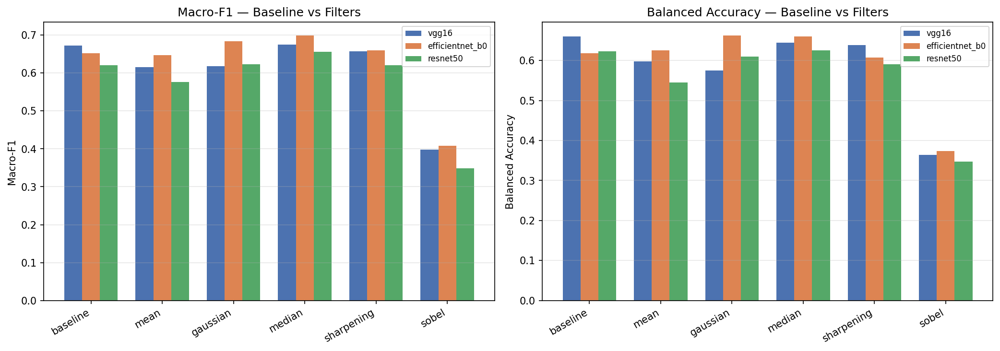

# Lab 2 — Effect of Image Filtering on Skin-Lesion Classification

Investigates how five spatial-domain image-processing filters affect the performance of the top-3 pretrained models identified in [Lab 1](../Lab1), when classifying skin lesions on the **HAM10000** dataset.

## 🧪 Setup

- **Dataset:** HAM10000 (`kmader/skin-cancer-mnist-ham10000` on Kaggle, downloaded via `kagglehub`)
- **Models (from Lab 1, top-3 by F1-score / AUC):** `vgg16`, `efficientnet_b0`, `resnet50` (loaded via `timm`)
- **Filters:** Average/Mean, Gaussian, Median, Sharpening, Sobel edge — plus an unfiltered baseline
- **Split:** Single stratified train/val/test split, reused unchanged across all 18 (model × filter) runs for a fair comparison

## ✅ Results (all 18 runs complete)

| Model | Filter | Macro-F1 | Balanced Acc. | AUC |
|---|---|---|---|---|
| vgg16 | baseline | 0.6727 | 0.6603 | 0.9455 |
| vgg16 | mean | 0.6156 | 0.5974 | 0.9450 |
| vgg16 | gaussian | 0.6176 | 0.5755 | 0.9446 |
| vgg16 | median | 0.6743 | 0.6449 | 0.9507 |
| vgg16 | sharpening | 0.6572 | 0.6387 | 0.9473 |
| vgg16 | sobel | 0.3975 | 0.3645 | 0.8507 |
| efficientnet_b0 | baseline | 0.6523 | 0.6182 | 0.9558 |
| efficientnet_b0 | mean | 0.6473 | 0.6251 | 0.9549 |
| efficientnet_b0 | gaussian | 0.6832 | 0.6627 | 0.9591 |
| efficientnet_b0 | median | **0.6990** | 0.6602 | **0.9611** |
| efficientnet_b0 | sharpening | 0.6598 | 0.6080 | 0.9576 |
| efficientnet_b0 | sobel | 0.4087 | 0.3740 | 0.8373 |
| resnet50 | baseline | 0.6200 | 0.6230 | 0.9438 |
| resnet50 | mean | 0.5765 | 0.5449 | 0.9352 |
| resnet50 | gaussian | 0.6234 | 0.6095 | 0.9418 |
| resnet50 | median | 0.6564 | 0.6251 | 0.9498 |
| resnet50 | sharpening | 0.6202 | 0.5911 | 0.9476 |
| resnet50 | sobel | 0.3491 | 0.3476 | 0.8105 |

**Key findings:**
- **Sobel** causes a large, consistent performance collapse across all 3 models — driven mainly by minority lesion classes (e.g. `df`, `vasc`) losing most of their recall.
- **Median** is the only filter that never hurts, and is the best-performing overall — even beating the unfiltered baseline for `efficientnet_b0` and `resnet50`.
- **Gaussian**'s effect is model-dependent: it hurts `vgg16` but helps `efficientnet_b0`/`resnet50`.
- `efficientnet_b0` is the most filter-robust of the three models.

Full per-question analysis is in the notebook's **Comparative Analysis** section.

## 📊 What the notebook contains

- Confusion matrices, training/validation accuracy & loss curves for every one of the 18 runs
- Per-class precision/recall/F1, macro-F1, balanced accuracy, AUC/ROC per run
- The comparison table and summary chart above
- Written analysis answering the lab's 10 questions

## ▶️ How to run

1. Open `Lab_Task_02.ipynb` in Google Colab (GPU runtime recommended: *Runtime → Change runtime type → GPU*).
2. Run all cells top to bottom — the setup cell installs `timm` and `kagglehub`; the dataset section downloads HAM10000 automatically (Kaggle login may be prompted on first run).
3. Training/evaluation across all 18 (model × filter) combinations is resumable: progress is saved to Google Drive after each run, so a disconnected runtime can just re-run from the top without losing completed work.

## 📄 Notebook

[`Lab_Task_02.ipynb`](./Lab_Task_02.ipynb)

## 👤 Author

**Prevesh Maryam**
Final Year BS AI Student — COMSATS University Islamabad, Wah Campus
GitHub: [@Maryam-sudo-png](https://github.com/Maryam-sudo-png)
